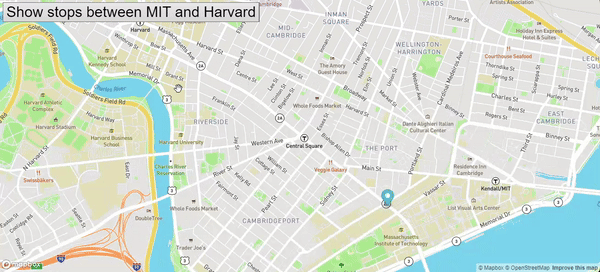

# Real Time Bus Tracker

## Description
This project tracks buses in real-time between MIT and Harvard using Mapbox. It shows the bus stops and moves a marker to simulate the bus's journey.

## How to Run
1. Clone the repository: `git clone https://github.com/LucaBrizuela/RealTimeBusTracker.git`
2. Open `index.html` in your web browser.

## Roadmap
- Add real-time data from an actual bus API.
- Improve the UI with more details about each bus stop.
- Initially, the map won’t display. Navigate to the `mapanimation.js` file and locate the line const `ACCESS_TOKEN = ''`;. Insert your Mapbox access token within the quotes to enable the map functionality.

## License
This project is licensed under the MIT License. See the [LICENSE](https://github.com/LucaBrizuela/RealTimeBusTracker/blob/main/LICENSE) file for details.

## Results

